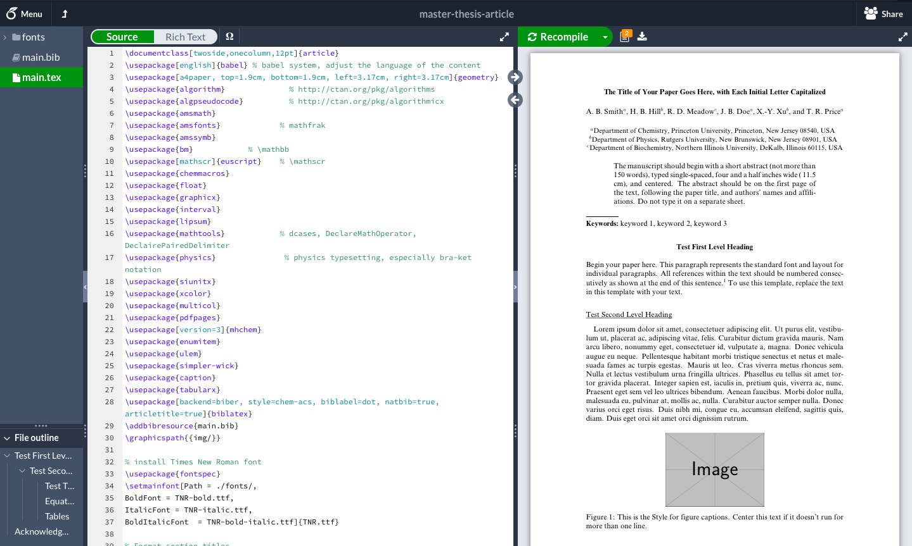
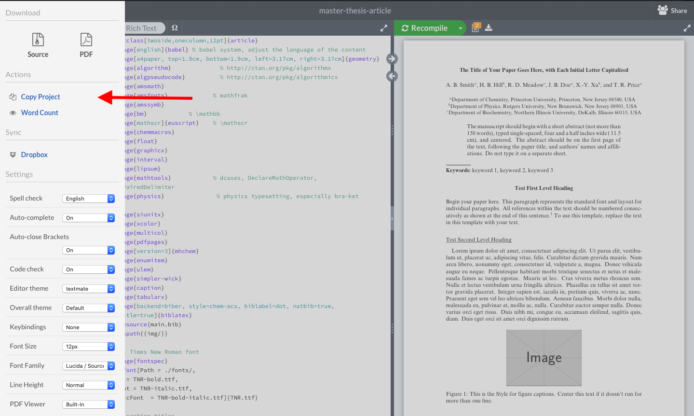
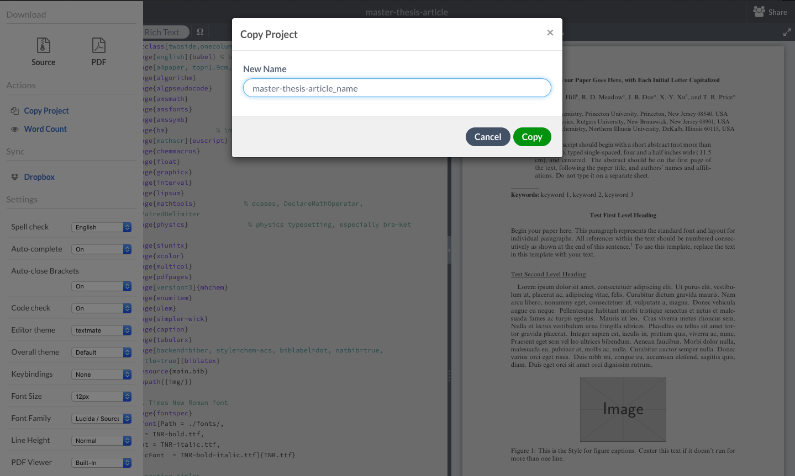
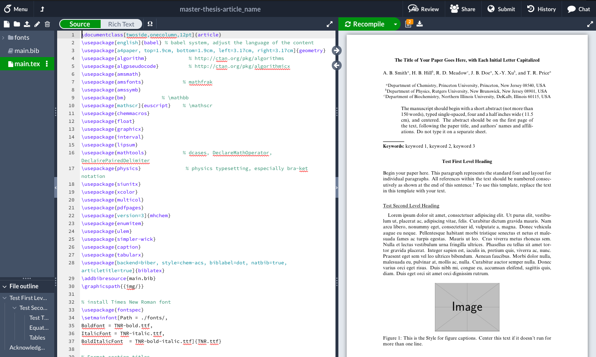

- Click on the Overleaf link on the [home GitHub page](README.md). An Overleaf project will open with the article template as shown below. Note that this is a read-only project and you cannot yet make changes.

- Click on the *Overleaf menu* button in the top left corner (indicated by the red arrow).

- The overleaf menu opens at the left of the screen. Next, click on *copy project* under the tab *Actions* to copy the template to an editable project.

- Give the editable project a name of choice.

- A new Overleaf project of the template will open with the chosen name. This project has write access and can now be edited.

